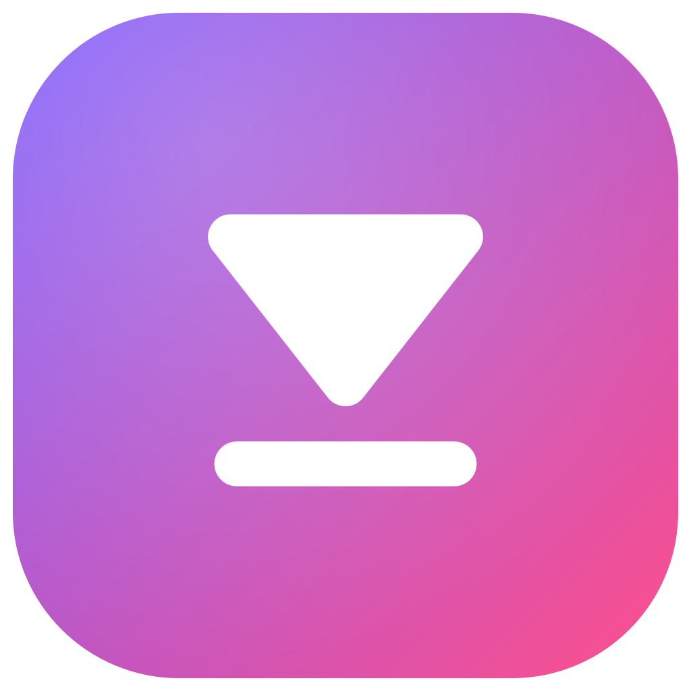
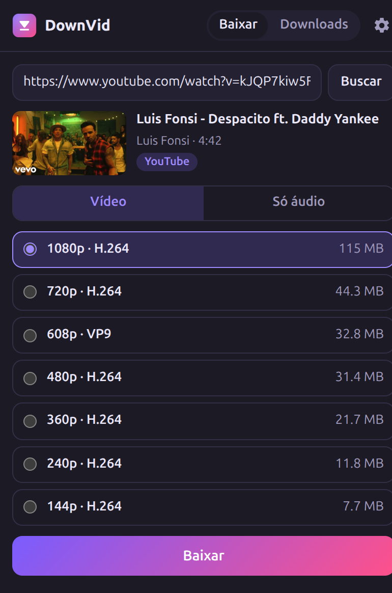
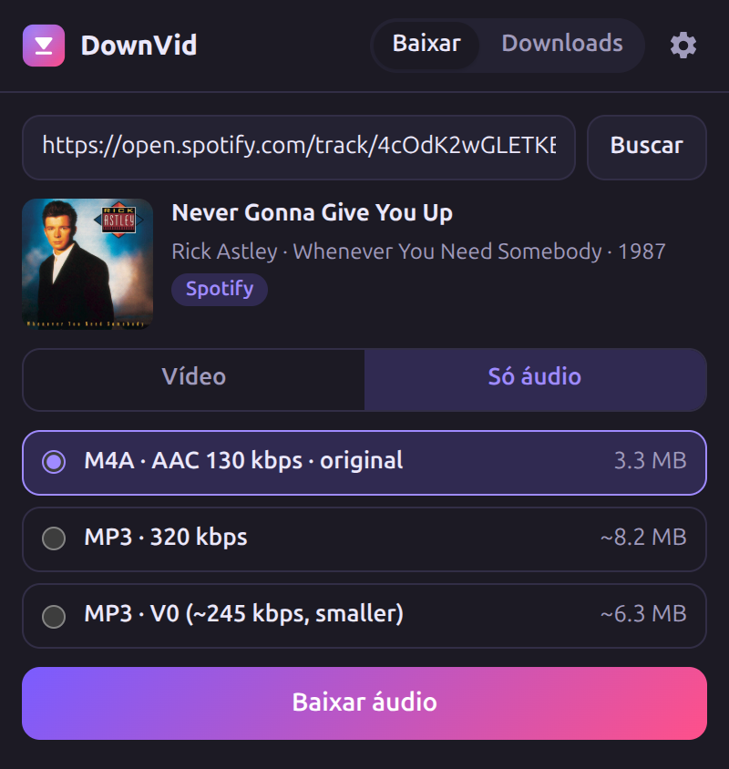
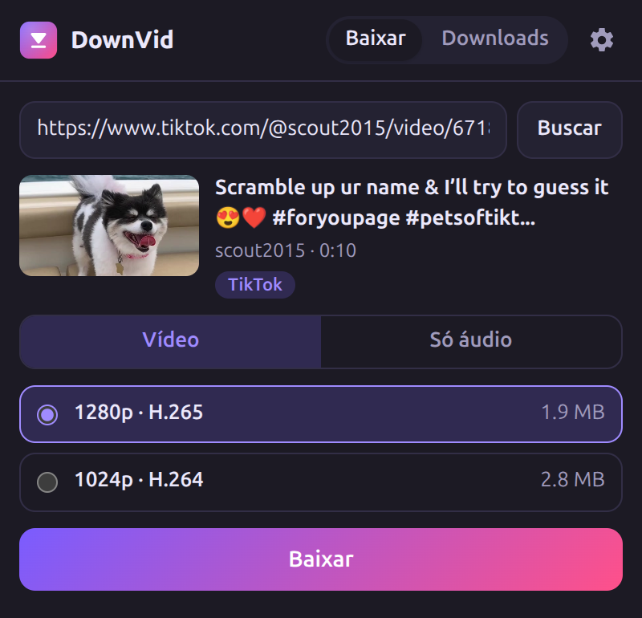
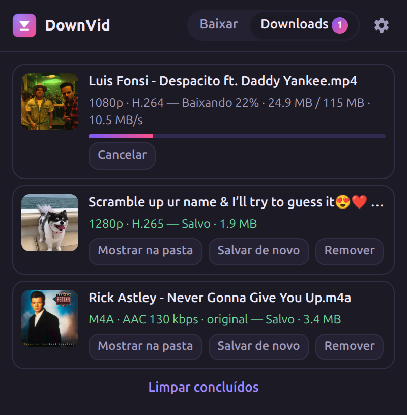
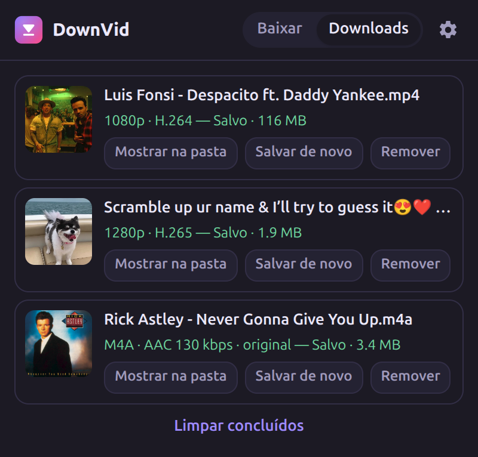
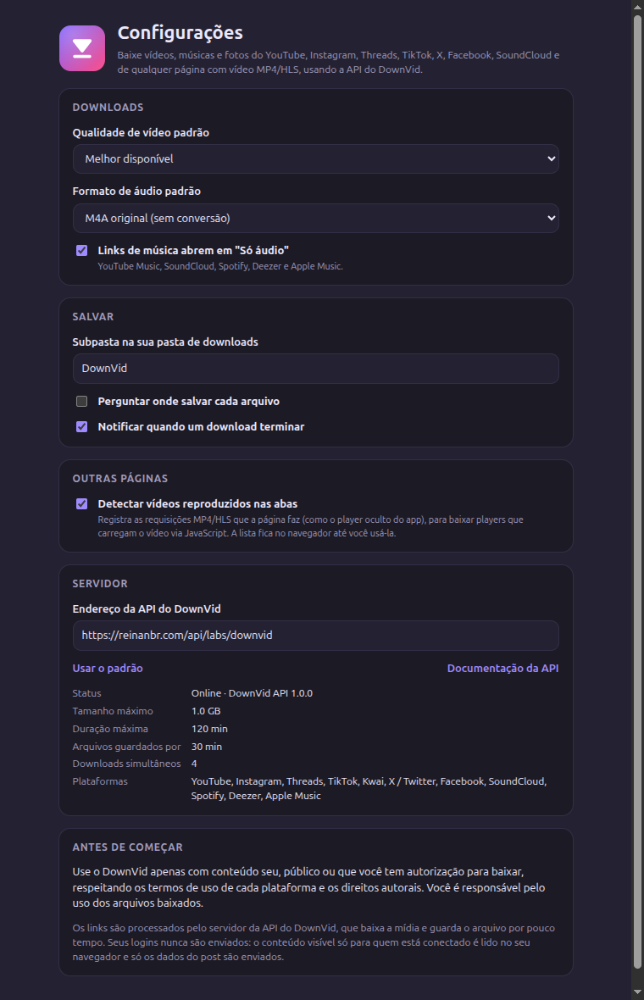

<p align="center"></p>

<h1 align="center">DownVid: extensão de navegador</h1>

<p align="center">
  <a href="https://github.com/reinanbr/downvid-extension/actions/workflows/ci.yml"></a>
  <a href="https://github.com/reinanbr/downvid-extension/releases/latest"></a>
</p>

Baixe vídeos, músicas e fotos do **YouTube, YouTube Music, Instagram, Threads,
TikTok, X/Twitter, Facebook, SoundCloud**, de links do **Spotify, Deezer e
Apple Music** (a mesma gravação, encontrada no YouTube Music) e de qualquer
página com vídeo MP4/HLS. É a versão para navegador do app Android
[DownVid](https://github.com/reinanbr/downvid), sobre a
[API do DownVid](https://reinanbr.com/labs/downvid/api).

> Use apenas com conteúdo seu, público ou que você tem autorização para
> baixar, respeitando os termos de cada plataforma e os direitos autorais.

## Download

| Navegador | Pacote |
|---|---|
| Chrome, Edge, Brave, Opera | [downvid-extension-chrome.zip](https://github.com/reinanbr/downvid-extension/releases/latest/download/downvid-extension-chrome.zip) |
| Firefox 128+ | [downvid-extension-firefox.zip](https://github.com/reinanbr/downvid-extension/releases/latest/download/downvid-extension-firefox.zip) |

Cada push gera os mesmos zips como artefato do
[CI](https://github.com/reinanbr/downvid-extension/actions/workflows/ci.yml)
(artefato `downvid-extension`).

### Instalar

- **Chrome / Edge / Brave**: descompacte o zip, abra `chrome://extensions`,
  ative o *Modo do desenvolvedor*, clique em *Carregar sem compactação* e
  escolha a pasta.
- **Firefox**: `about:debugging#/runtime/this-firefox` → *Carregar extensão
  temporária…* → escolha o zip (ou o `manifest.json`). Em `about:addons` →
  DownVid → *Permissões*, permita o acesso a todos os sites.

## Telas

| YouTube | Música (Spotify → YouTube Music) | TikTok |
|---|---|---|
|  |  |  |

| Downloads (baixando no servidor) | Downloads concluídos |
|---|---|
|  |  |



## Como usar

- **Ícone da barra**: abre a busca para a aba atual (ou cole um link).
  Escolha a qualidade, ou *Só áudio* (M4A original, MP3 320 ou MP3 V0, com
  tags e capa), e clique em *Baixar*. Carrosséis do Instagram e
  do Threads têm caixas de seleção.
- **Menu de contexto**: "Baixar link com o DownVid" em links, "Baixar desta
  página" em páginas e vídeos, e "Baixar link selecionado" em texto.
- **Downloads**: a fila com o progresso (baixando, juntando, convertendo),
  cancelar, mostrar na pasta e salvar de novo. Os arquivos vão para
  `Downloads/DownVid/`. Um download que falhou (por exemplo, um link do
  YouTube que expirou) pode ser tentado de novo: a extensão extrai o link
  outra vez e reinicia a mesma opção, como a renovação de links do app.
- **Configurações**: qualidade padrão, formato de áudio, links de música em
  *Só áudio*, subpasta, perguntar onde salvar, notificações, detector de
  vídeos e o endereço da API.

## Como funciona

Tudo passa pela [API do DownVid](https://reinanbr.com/labs/downvid/api):
`POST /v1/extract` lista as opções, `POST /v1/jobs` baixa no servidor (junta
vídeo e áudio, converte para MP3/M4A com tags e capa), a extensão acompanha o
job e salva `GET /v1/jobs/{id}/file` com o gerenciador de downloads. O que
muda por link é como as opções são obtidas (como no `ExtractController` do
app):

| Link | Rota |
|---|---|
| **YouTube, YouTube Music, TikTok, X, Facebook, SoundCloud…** | `/v1/extract` (yt-dlp no servidor). Se nada for encontrado e o link for a aba aberta, os vídeos que a aba carregou vão para `/v1/probe`. |
| **Spotify / Deezer / Apple Music** | `/v1/extract` lê a faixa e encontra a mesma gravação no YouTube Music (mesma duração ±5 s). Abre direto em *Só áudio*, com álbum, ano e capa (`/v1/music/meta`). |
| **Instagram** | `/v1/extract` (consulta pública no servidor). Se o Instagram recusa o servidor, a mesma consulta pública é feita na página do post, no navegador. Posts privados e stories usam a sessão do usuário (`/api/v1/media/{id}/info/`, `reels_media`) e só a resposta vai para `/v1/parse/instagram`. |
| **Threads** | `/v1/extract`; se o post está oculto para visitantes, os dados que a página do post embute ou busca → `/v1/parse/threads`. |
| **Qualquer outra página** | `/v1/extract` (scan + yt-dlp) e, em paralelo, `/v1/probe` com as requisições MP4/HLS da aba (detector de rede, como o `PageSniffer` do app) e os `<video>`/`og:video` do DOM. |

### YouTube e o servidor

O YouTube pede verificação anti-bot para endereços de datacenter. O servidor
da API resolve isso com o yt-dlp usando um provedor de *PO token*
([bgutil-ytdlp-pot-provider](https://github.com/Brainicism/bgutil-ytdlp-pot-provider))
e os cookies de uma conta do YouTube dedicada a isso (veja o README da API).
A extensão não guarda nem envia sessões do YouTube.

### Privacidade

A sessão do Instagram e do Threads nunca sai do navegador: a extensão envia
à API só a resposta do post. O detector
guarda as URLs de mídia em `storage.session` (some ao fechar o navegador) e
só as envia quando você pede um download daquela aba. Os limites (arquivo de
1 GB, 120 min, 4 downloads simultâneos no servidor, requisições por minuto)
vêm de `GET /v1/info`; quando o servidor recusa por excesso de jobs, a
extensão espera na fila local.

## Desenvolvimento

```bash
npm ci
npm test            # links, ids do Instagram, títulos
npm run lint        # web-ext lint
npm run build       # dist/downvid-extension-chrome.zip e -firefox.zip
npx web-ext run     # abre o Firefox com a extensão
```

O CI (`.github/workflows/ci.yml`) roda checagem de sintaxe, testes, lint e
build em cada push e PR, e publica os zips como artefato. Tags `v*` (por
exemplo `v0.2.0`, igual ao `version` do `manifest.json`) criam um GitHub
Release com os zips, e é para ele que os links de download apontam.

```
manifest.json
src/background.js       detector de rede, fila de jobs, downloads, menu de contexto
src/extract.js          escolha da rota de extração (porta do ExtractController do app)
src/api.js              cliente da API do DownVid
src/links.js            plataformas, id de mídia do Instagram
src/page_scripts.js     consultas do Instagram/Threads nas abas (porta do InstagramQuery.kt)
src/threads_hook.js     guarda as respostas com mídia nas páginas do Threads
popup/, options/        interface
_locales/en, pt_BR      traduções
test/                   testes (node --test)
```

## Limitações

- Lives, DRM e manifestos DASH `.mpd` de páginas genéricas não são suportados.
- O que o servidor não baixa (por exemplo, quando o YouTube bloqueia o
  endereço dele), a extensão também não baixa: ela mostra o erro da API.
- Conteúdo do Instagram ou Threads visível só para quem está conectado precisa
  de login no navegador; stories sempre precisam.

## Licença

[GPL-3.0](LICENSE), como o app DownVid.
